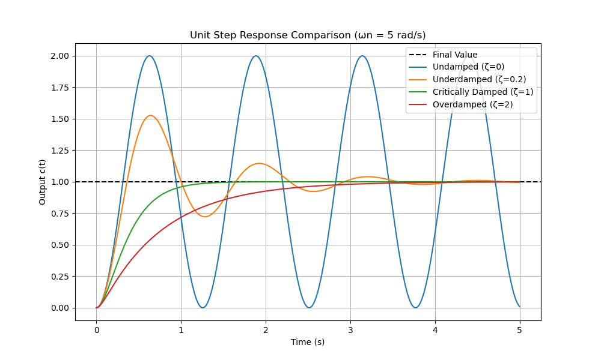
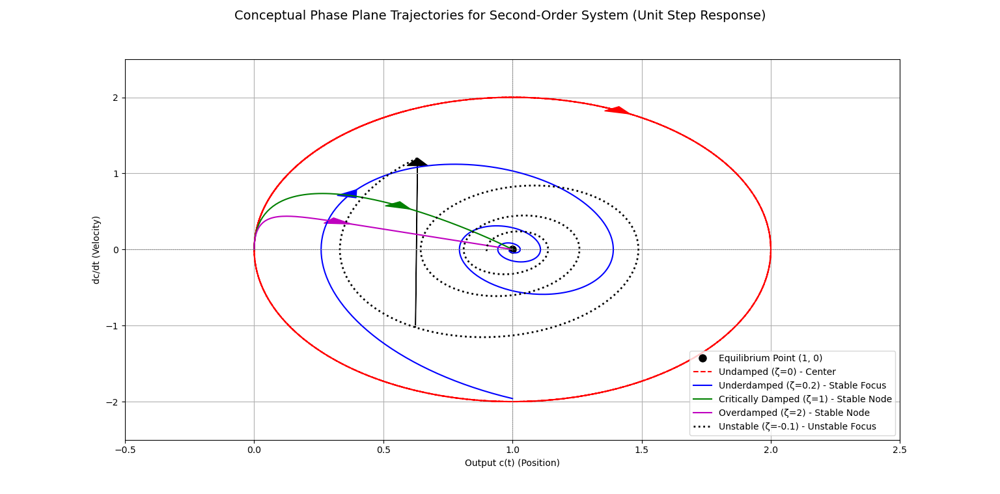

This document provides a comprehensive explanation of the control theory governing **Standard Second-Order Systems**, detailing the fundamental parameters, the role of poles in system stability and behavior, key transient response specifications, and visual interpretations.

***

## I. Standard Form and Core Parameters

The analysis of second-order systems is based on the **standard closed-loop transfer function** $G(s)$:

```math
G(s) = \frac{Y(s)}{R(s)} = \frac{\omega_n^2}{s^2 + 2\zeta\omega_n s + \omega_n^2} \text{}
```

This function is defined by two **core parameters**:

1.  **Undamped Natural Frequency ($\omega_n$):** This parameter determines the **speed** of the system response, measured in radians per second (rad/s).
2.  **Damping Ratio ($\zeta$):** This parameter determines the **shape** of the system response (oscillatory or non-oscillatory) and is dimensionless.

***

## II. System Dynamics: The Poles and Stability (The $s$-Plane)

The system's dynamic behavior is entirely governed by its **poles**, which are the roots of the **characteristic equation**:

```math
s^2 + 2\zeta\omega_n s + \omega_n^2 = 0 \text{}
```

The two poles, $s_{1, 2}$, are found using the quadratic formula:

```math
s_{1, 2} = -\zeta\omega_n \pm \omega_n\sqrt{\zeta^2 - 1} \text{}
```

The term **Decay Rate** ($\sigma$) is often defined as the real part of the poles:

```math
\mathbf{\sigma} = \zeta\omega_n \text{}
```

(This $\sigma$ represents the distance of the pole from the imaginary axis in the $s$-plane).

### Stability Criteria Based on Poles

The location of the poles in the complex $s$-plane dictates the system's stability:

*   **Stable:** All poles lie in the **Left Half-Plane (LHP)**, meaning their real part is negative ($\text{Re}(s) < 0$). This occurs when the damping ratio **$\zeta > 0$**.
*   **Marginally Stable:** Poles are on the imaginary axis ($j\omega$-axis), meaning their real part is zero ($\text{Re}(s) = 0$). This occurs when $\zeta = 0$.
*   **Unstable:** Any pole lies in the **Right Half-Plane (RHP)**, meaning their real part is positive ($\text{Re}(s) > 0$). This occurs when the damping ratio is negative, **$\zeta < 0$** (negative damping).

| Pole Type | $\text{Re}(s)$ | $\zeta$ Value | Stability | Location in $s$-Plane |
| :------ | :------ | :------ | :------ | :------ |
| **Negative Poles** | Negative | $\zeta > 0$ | **Stable** | LHP |
| **Positive Poles** | Positive | $\zeta < 0$ | **Unstable** | RHP |
| **Imaginary Poles** | Zero | $\zeta = 0$ | Marginally Stable | On $j\omega$-axis |

***

## III. Damping Status and Response Characteristics

The relationship between the poles and the damping ratio ($\zeta$) determines the fundamental response characteristics of the system.

| Damping Status | $\zeta$ Range | Pole Type | Poles $s_{1, 2}$ | Response Description | Common Example System |
| :------ | :------ | :------ | :------ | :------ | :------ |
| **Undamped** | $\zeta = 0$ | Imaginary | $\pm j\omega_n$ | **Pure oscillation**, never settles. | An ideal **mass-spring system** in a perfect vacuum (no friction). |
| **Underdamped** | $0 < \zeta < 1$ | Complex Conjugate | $-\sigma \pm j\omega_d$ | **Damped oscillation** (oscillates and settles). Fastest speed with acceptable overshoot. | A **shock absorber** on a car that is too soft. |
| **Critically Damped** | $\zeta = 1$ | Real & Equal | $-\omega_n, -\omega_n$ | **Fastest non-oscillatory response**. Ideal transition point. | A properly designed **door closer** that shuts quickly without slamming. |
| **Overdamped** | $\zeta > 1$ | Real & Distinct | $-\sigma_a, -\sigma_b$ | Slow, **non-oscillatory response** (lagging). Safe but sluggish. | A system with **excessive friction**, like a heavy bank vault door closing slowly. |
| **Unstable** | $\zeta < 0$ | Positive Real Part | $\sigma \pm j\omega$ | Oscillations or **exponential growth**. | A rocket balancing on its tail with an uncompensated control system. |

***

## IV. Transient Response Specifications

The **transient response** refers to the initial behavior of the system before it settles. These specifications are primarily relevant for **underdamped systems** ($0 < \zeta < 1$).

### 1. Damped Natural Frequency ($\omega_d$)
This is the actual frequency of oscillation of the decaying response in an underdamped system.

```math
\mathbf{\omega_d} = \omega_n\sqrt{1-\zeta^2} \text{}$$
```
*Relation to Poles:* $\omega_d$ is the magnitude of the **imaginary part** of the complex conjugate poles.

### 2. Peak Time ($T_p$)
The time required for the response to reach the **first peak of the overshoot**. This is a measure of the speed of response.

```math
\mathbf{T_p} = \frac{\pi}{\omega_d} = \frac{\pi}{\omega_n\sqrt{1-\zeta^2}} \text{}
```
*Relation to Poles:* Primarily determined by the **imaginary part** of the pole ($\omega_d$).

### 3. Percent Overshoot ($%OS$ or $M_p$)
The amount the response **overshoots** the final steady-state value, expressed as a percentage. This is a measure of relative stability.

```math
\mathbf{\%OS} = 100 \cdot e^{-\frac{\zeta\pi}{\sqrt{1-\zeta^2}}}$
```

Alternatively, it can be defined as:

```math
\mathbf{\%OS} = \frac{c(T_p) - c(\infty)}{c(\infty)} \times 100
```

**Finding $\zeta$ from Overshoot:** If $M_p$ is the fractional overshoot (e.g., $M_p=0.1$ for $10\%$ overshoot), the damping ratio can be found by inversion:

```math
\mathbf{\zeta} = \frac{|\ln(M_p)|}{\sqrt{\pi^2 + (\ln(M_p))^2}} \text{}
```

*Relation to Poles:* Depends only on the **Damping Ratio** $\zeta$.

### 4. Settling Time ($T_s$)
The time required for the response to settle within a defined percentage (usually $2\%$ or $5\%$) of the final steady-state value. This is a measure of system speed and stability.

$T_s$ is inversely proportional to the **Decay Rate** ($\sigma = \zeta\omega_n$):

| Criterion | Formula for Settling Time $\mathbf{T_s}$ |
| :-------- | :--------------------------------------- |
| **2% Criterion** (More common) | ```math
mathbf{T_{s,2\%}} \approx \frac{4}{\zeta \omega_n} = \frac{4}{\sigma}``` |
| **5% Criterion** (Less conservative) | $\mathbf{T_{s,5\%}} \approx \frac{3}{\zeta \omega_n} = \frac{3}{\sigma}$ |


*Relation to Poles:* Primarily determined by the **real part** of the pole ($\sigma$).

### 5. Rise Time ($T_r$)
The time required for the response to rise from $10\%$ to $90\%$ of its final value (for overdamped/critically damped) or from $0\%$ to $100\%$ (for underdamped). A common approximation for $0.1 < \zeta < 1.0$ is used:

```math
\mathbf{T_r} \approx \frac{1.8}{\omega_n} \text{}
```

***

## V. Impact of Damping Ratio ($\zeta$) on System Specifications

The damping ratio $\zeta$ is a crucial design parameter that controls the character and stability margin of the response. Optimal control design often targets a $\zeta$ close to $\approx 0.707$ to balance speed and overshoot (resulting in roughly $4\%$ to $5\%$ overshoot).

| Specification | Relationship with $\zeta$ (Assuming $\omega_n$ is constant) | Impact of **Larger $\zeta$** |
| :------ | :------ | :------ |
| **Percent Overshoot ($%OS$)** | Exponentially decreases as $\zeta$ increases. | **Shorter overshoot.** For $\zeta \ge 1$, overshoot is zero. |
| **Settling Time ($T_s$)** | Inversely proportional to $\zeta$ (via $\sigma = \zeta\omega_n$). | **Shorter settling time** (faster decay), up to the critical point $\zeta=1$. (Past $\zeta=1$, $T_s$ increases). |
| **Peak Time ($T_p$)** | Increases as $\zeta$ increases. | **Longer peak time** (slower to reach the first peak). |
| **Damped Frequency ($\omega_d$)** | Decreases as $\zeta$ increases. | **Lower oscillation frequency** (slower oscillations). |
| **Response Speed** (General) | A trade-off between $\zeta$ and $\omega_n$. | **Less oscillatory** but potentially **slower** if $\zeta \gg 1$. The fastest response is achieved at $\zeta=1$. |

***

## VI. Geometrical Interpretation

### A. Poles in the $s$-Plane

In the Left Half-Plane (LHP), the stable poles are geometrically related to the core parameters:

1.  **Radius:** The poles lie on a semi-circle whose radius is equal to $\omega_n$.
2.  **Angle ($\theta$):** The angle $\theta$ a pole makes with the negative real axis is directly related to the damping ratio:
$$\mathbf{\zeta = \cos(\theta)} \text{}$$

### B. Trajectory Graphs (Phase Plane Analysis)

A **trajectory graph** (or **phase portrait**) plots the system's output variable (position, $c$) versus its derivative (velocity, $\dot{c}$). This visualizes the system's path from its initial state to the **equilibrium point**.

For a unit step input, the equilibrium point (where the system settles) is at $(\mathbf{1}, \mathbf{0})$. Arrows on the trajectories indicate the direction of time.

#### Phase Plane Descriptions

| Damping Status | Trajectory Description | Key Behavior |
| :------ | :------ | :------ |
| **Undamped ($\zeta=0$)** | **Center** (Stable Orbit). The trajectory is a closed loop (ellipse/circle) centered on the equilibrium point. | **Sustained oscillations**, never settles. |
| **Underdamped ($0 < \zeta < 1$)** | **Stable Focus**. The trajectory is an **inward spiral** that converges toward the equilibrium point. | **Decaying oscillations** (the spiraling reflects the sinusoidal response). |
| **Critically/Overdamped ($\zeta \ge 1$)** | **Stable Node**. The trajectory is a **smooth, non-oscillatory curve** that moves directly to the equilibrium point. | Fastest non-oscillatory path ($\zeta=1$); slower path ($\zeta>1$). |
| **Unstable ($\zeta < 0$)** | **Unstable Focus (or Node)**. The trajectory is an **outward spiral** (or curve) that moves away from the equilibrium point. | Response exhibits **exponentially increasing amplitude**. |

***

## VII. System Response Visualizations

### 1. Example System Step Response Graph

This simulated output compares the unit step response for the four stable damping statuses with a fixed $\omega_n = 5 \text{ rad/s}$.

*   **Undamped ($\zeta=0$):** Oscillates indefinitely.
*   **Underdamped ($0 < \zeta < 1$):** Shows **overshoot** and decaying oscillations.
*   **Critically Damped ($\zeta=1$):** Reaches the final value fastest **without overshoot**.
*   **Overdamped ($\zeta>1$):** Slowest response, approaches value asymptotically **without oscillation**.



### 2. Trajectory Graph (Phase Plane Comparison)

This conceptual visualization plots velocity ($\dot{c}$) vs. position ($c$) on the phase plane, showing the path taken by the system towards or away from the equilibrium point $(1, 0)$.

*   **Undamped ($\zeta=0$):** Closed ellipse/circle (Red Dashed).
*   **Underdamped ($0 < \zeta < 1$):** Converging spiral (Blue Solid).
*   **Critically Damped ($\zeta=1$):** Direct, quick path to equilibrium (Green Solid).
*   **Overdamped ($\zeta > 1$):** Slower, direct path to equilibrium (Magenta Solid).
*   **Unstable ($\zeta < 0$):** Diverging spiral (Black Dotted).

